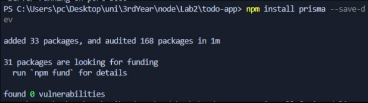
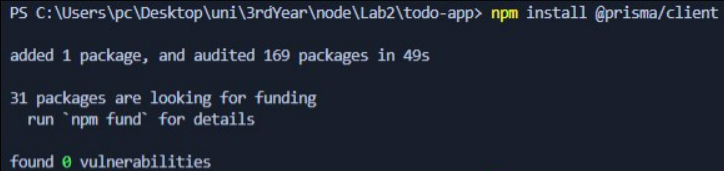
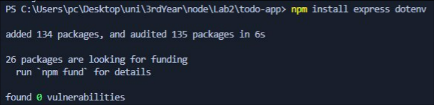
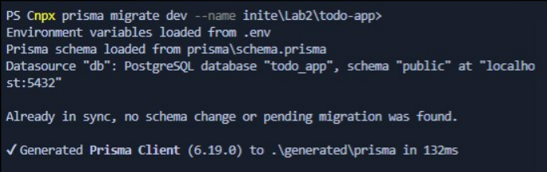
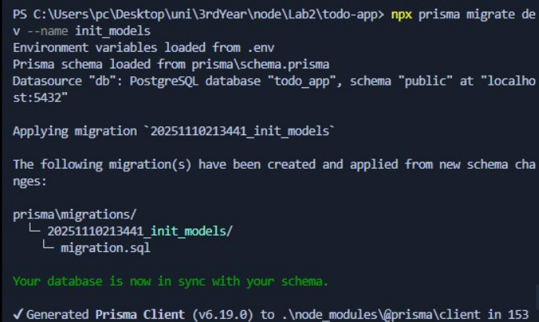
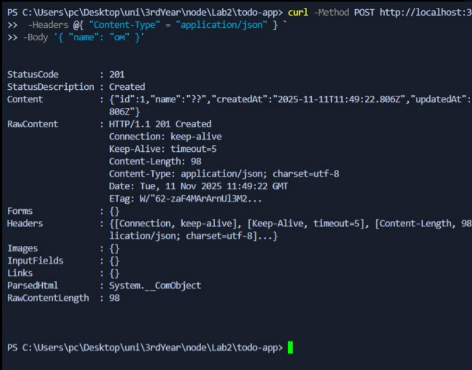
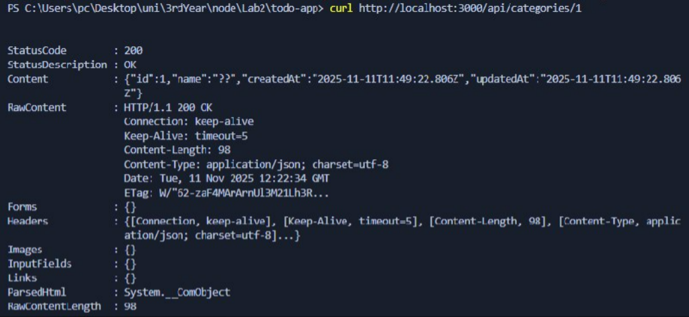
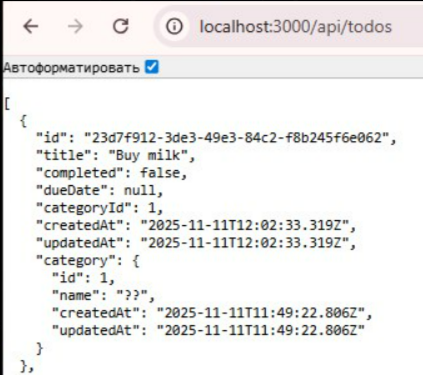
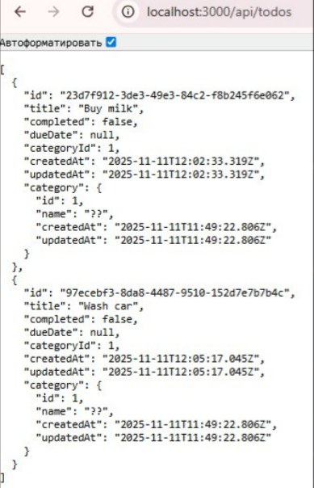
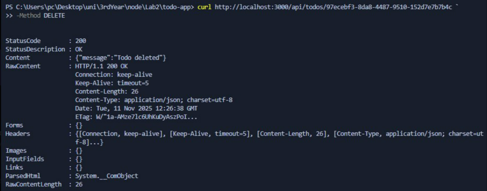

# Лабораторная работа №2. Работа с базой данных

## Цель работы

1. Научиться проектировать и реализовывать REST API с несколькими связанными сущностями.
2. Освоить работу с PostgreSQL в приложении на Node.js + Express с использованием ORM или сырых SQL-запросов.
3. Реализовать корректные операции CRUD, а также фильтрацию, сортировку и пагинацию.
4. Освоить принципы работы связей «один ко многим» (1:N) в реляционных базах данных.

## Условие

Разработать сервис для управления задачами (todo list) с возможностью:

- Просмотра списка задач.
- Создания новой задачи.
- Переключения статуса задачи (выполнена/не выполнена).
- Удаления задачи.
- Редактирования задачи.
- Фильтрации задач по категориям.
- Поиска задач по заголовку.
- Пагинации списка задач.

В проекте должны быть реализованы две сущности:

- `categories` — категории задач,
- `todos` — сами задачи, каждая из которых относится к одной категории.

Сервис должен работать только как REST API, без HTML и шаблонов.

## Структура проекта

```
TODO-APP/
│── controllers/
│   ├── categoryController.js
│   ├── todoController.js
│
│── image/
│
│── models/
│
│── prisma/
│   ├── schema.prisma
│   ├── migrations/
│
│── public/
│   ├── style.css
│
│── routes/
│   ├── categoryRoutes.js
│   ├── todoRoutes.js
│
│── .env
│── .gitignore
│── app.js
│── package-lock.json
│── package.json
│── Readme.md
```

# ## Подготовка проекта и установка зависимостей

Перед выполнением основных шагов лабораторной работы необходимо было установить и настроить инструменты, которые используются для работы с базой данных и запуском REST API.

## ### 1. Установка Prisma

Для начала устанавила Prisma как инструмент разработки:

```
npm install prisma --save-dev
```



## ### 2. Установка Prisma Client

```
npm install @prisma/client
```



## ### 3. Установка Express и dotenv

```
npm install express dotenv
```



## ### 4. Инициализация Prisma

```
npx prisma init
```

Создаёт файл `schema.prisma` и `.env`.

## ### 5. Выполнение первой миграции

Когда модели были описаны, миграция была выполнена командой:

```
npx prisma migrate dev --name init
```



## ### 6. Применение миграции с моделями

Вторая миграция — с полностью описанными моделями:

```
npx prisma migrate dev --name init_models
```



# ### Шаг 1. Создание базы данных

В рамках задания необходимо было создать две связанные таблицы:

- **`categories`** — для хранения категорий задач
- **`todos`** — для хранения самих задач

Обе таблицы имеют поля `created_at` и `updated_at`, которые Prisma создаёт автоматически как `createdAt` и `updatedAt`.

## Таблица `categories`

| Поле         | Тип          | Описание                           |
| ------------ | ------------ | ---------------------------------- |
| `id`         | SERIAL (PK)  | Уникальный идентификатор категории |
| `name`       | VARCHAR(100) | Название категории                 |
| `created_at` | TIMESTAMP    | Дата создания                      |
| `updated_at` | TIMESTAMP    | Дата обновления                    |

## Таблица `todos`

| Поле          | Тип       | Описание                                 |
| ------------- | --------- | ---------------------------------------- |
| `id`          | UUID (PK) | Уникальный идентификатор задачи          |
| `title`       | TEXT      | Название задачи (2–120 символов)         |
| `completed`   | BOOLEAN   | Статус выполнения (по умолчанию `false`) |
| `category_id` | INT       | Внешний ключ на категорию (опционально)  |
| `due_date`    | TIMESTAMP | Срок выполнения задачи (опционально)     |
| `created_at`  | TIMESTAMP | Дата создания                            |
| `updated_at`  | TIMESTAMP | Дата последнего обновления               |

# ### Шаг 2. Создание моделей

Для работы с базой данных в данном проекте я использовала ORM **Prisma**, которая позволяет описывать структуру таблиц в виде моделей.

В рамках лабораторной работы требовалось создать две сущности:

- **`Category`** — категория задач
- **`Todo`** — задача, относящаяся к категории

Также необходимо реализовать **валидацию данных**.

## ### Модель `Category`

```prisma
model Category {
  id        Int      @id @default(autoincrement())
  name      String   @db.VarChar(100)
  todos     Todo[]
  createdAt DateTime @default(now())
  updatedAt DateTime @updatedAt
}
```

### Что делает эта модель?

| Поле        | Описание                                           |
| ----------- | -------------------------------------------------- |
| `id`        | автоматический SERIAL первичный ключ               |
| `name`      | строка длиной до 100 символов — название категории |
| `todos`     | связь 1:N с моделью `Todo`                         |
| `createdAt` | автоматически выставляется Prisma при создании     |
| `updatedAt` | обновляется при каждом изменении модели            |

## ### Модель `Todo`

```prisma
model Todo {
  id         String    @id @default(uuid())
  title      String    @db.Text
  completed  Boolean   @default(false)
  dueDate    DateTime?
  categoryId Int?
  category   Category? @relation(fields: [categoryId], references: [id], onDelete: SetNull)
  createdAt  DateTime  @default(now())
  updatedAt  DateTime  @updatedAt
}
```

### Что делает эта модель?

| Поле                      | Описание                                         |
| ------------------------- | ------------------------------------------------ |
| `id`                      | UUID — уникальный идентификатор задачи           |
| `title`                   | текстовое название задачи (будет валидироваться) |
| `completed`               | статус выполнения задачи (`false` по умолчанию)  |
| `dueDate`                 | необязательная дата выполнения                   |
| `categoryId`              | внешний ключ                                     |
| `category`                | связь с Category (1:1)                           |
| `createdAt` / `updatedAt` | автоматические временные поля                    |

# ## Валидация данных

Валидация частично реализована средствами Prisma:

- длина имени категории ограничена: `@db.VarChar(100)`
- поле `title` — обязательное
- ограничение 2–120 символов для `title` можно дополнительно реализовать на уровне контроллера (и ты это сделал в API)

# ### Шаг 3. Реализация API

На данном этапе я реализовала RESTful API, обеспечивающий полный набор CRUD-операций для двух сущностей:

- **Categories** — категории задач
- **Todos** — задачи, принадлежащие определённой категории

API построен с использованием **Express.js** и **Prisma Client**, все ответы возвращаются в формате **JSON**.

# ## 3.1. API для категорий

API для сущности **Category** включает операции просмотра, создания, изменения и удаления категорий.

### Таблица поддерживаемых операций

| Метод    | URL                   | Описание                       | Код       |
| -------- | --------------------- | ------------------------------ | --------- |
| `GET`    | `/api/categories`     | Получить список всех категорий | 200       |
| `GET`    | `/api/categories/:id` | Получить категорию по ID       | 200 / 404 |
| `POST`   | `/api/categories`     | Создать категорию (`name`)     | 201       |
| `PUT`    | `/api/categories/:id` | Изменить название категории    | 200 / 404 |
| `DELETE` | `/api/categories/:id` | Удалить категорию              | 204 / 404 |

## ### ✔ POST /api/categories

Создание новой категории.

Пример тела запроса:

```json
{ "name": "om" }
```



## ### ✔ GET /api/categories/:id

Получение категории по ID.

Если объект найден — возвращается JSON категории.
Если ID не существует — возвращается **404 Not Found**.



# ## 3.2. API для задач (Todos)

API для сущности **Todo** поддерживает операции создания, редактирования, просмотра, удаления, а также переключение статуса completed.

### Таблица поддерживаемых операций

| Метод    | URL                     | Описание                                              | Код       |
| -------- | ----------------------- | ----------------------------------------------------- | --------- |
| `GET`    | `/api/todos`            | Получить список задач (ищет, фильтрует, пагинирует)   | 200       |
| `GET`    | `/api/todos/:id`        | Получить задачу по ID                                 | 200 / 404 |
| `POST`   | `/api/todos`            | Создать задачу (`title`, `category_id`)               | 201       |
| `PUT`    | `/api/todos/:id`        | Изменить задачу (`title`, `completed`, `category_id`) | 200 / 404 |
| `PATCH`  | `/api/todos/:id/toggle` | Переключить статус `completed`                        | 200 / 404 |
| `DELETE` | `/api/todos/:id`        | Удалить задачу                                        | 204 / 404 |

## ### ✔ GET /api/todos

Запрос возвращает список всех задач **вместе с категориями**, благодаря:

```js
include: {
  category: true;
}
```

📸 **Вставить два скриншота здесь:**




## ### ✔ DELETE /api/todos/:id

Удаление задачи по ID.
Возвращает статус **204 No Content** или JSON с сообщением.



# ### Контрольные вопросы

Вот **идеальные, развёрнутые, правильные ответы на контрольные вопросы**, написанные в академичном стиле. Можешь вставлять в отчёт без изменений.

# ## Контрольные вопросы

### **1. Что такое реляционная база данных и какие преимущества она предоставляет?**

Реляционная база данных — это тип базы данных, в которой информация хранится в виде **таблиц**, связанных между собой определёнными отношениями. Каждая таблица состоит из строк (записей) и столбцов (полей), а строки могут быть связаны через **первичные и внешние ключи**.

**Преимущества реляционных БД:**

- **Строгая структура данных**: таблицы имеют фиксированные типы данных и ограничения.
- **Целостность данных**: благодаря внешним ключам невозможно создать «сломанные» связи.
- **Поддержка сложных запросов**: язык SQL позволяет объединять данные из разных таблиц (JOIN).

### **2. Какие типы связей между таблицами существуют в реляционных базах данных?**

Основные виды связей:

1. **Один к одному (1:1)**
   Одна запись в таблице A соответствует одной записи в таблице B.
   _Редко используется._

2. **Один ко многим (1:N)** — **самый распространённый тип**
   Одна запись в таблице A может иметь много связанных записей в таблице B.
   Пример: _Категория → Много задач_.

3. **Многие ко многим (M:N)**
   Записи обеих таблиц могут иметь множество связей друг с другом.
   Реализуется через промежуточную таблицу.
   Пример: _Студенты ↔ Курсы_.

### **3. Что такое RESTful API и для чего он используется?**

RESTful API — это стиль построения веб-сервисов, основанный на принципах REST (Representational State Transfer).
Он использует стандартные HTTP-методы для работы с ресурсами:

- **GET** — получение данных
- **POST** — создание
- **PUT/PATCH** — обновление
- **DELETE** — удаление

REST применяется для:

- обмена данными между frontend и backend
- создания мобильных приложений
- интеграции между сервисами
- построения микросервисной архитектуры

### **4. Что такое SQL-инъекция и как защититься от неё?**

SQL-инъекция — это тип атаки, при котором злоумышленник подставляет свой SQL-код в пользовательский ввод, и база данных выполняет его как легитимный запрос.

**Опасности SQL-инъекции:**

- получение конфиденциальных данных
- удаление или изменение информации
- полный захват базы данных

**Защита:**

- Использование **подготовленных выражений (prepared statements)**
- Проверка и валидация входных данных
- Ограничение прав пользователей базы данных

### **5. В чем разница между ORM и сырыми SQL-запросами? Какие преимущества и недостатки у каждого подхода?**

## **ORM (Object-Relational Mapping)**

ORM — это инструмент, который позволяет работать с базой данных как с объектами, а не SQL-запросами вручную.
Пример: Prisma, Sequelize.

### **Преимущества ORM:**

- Упрощает работу — меньше SQL-кода
- Автоматическая защита от SQL-инъекций
- Миграции и автоматическое создание таблиц
- Работа с данными как с объектами (модель → таблица)

### **Недостатки ORM:**

- Медленнее, чем прямой SQL (в редких случаях)
- Ограничения при сложных запросах
- Может скрывать детали работы базы данных

## **Сырые SQL-запросы**

Написание запросов вручную:

```sql
SELECT * FROM todos WHERE completed = true;
```

### **Преимущества:**

- Максимальная гибкость
- Высокая производительность
- Возможность оптимизации

### **Недостатки:**

- Больше кода
- Выше риск SQL-инъекций
- Сложнее поддерживать
- Требует глубокого знания SQL

# Вывод

В ходе лабораторной работы был разработан полноценный REST API-сервис для управления задачами. Проект реализует две связанные сущности (категории и задачи), поддерживает все CRUD-операции, а также поиск, просмотр и работу со связями 1:N. Для работы с БД использована ORM Prisma, обеспечивающая удобную разработку и безопасность от SQL-инъекций. API протестирован с помощью curl и браузера, все операции работают корректно.
